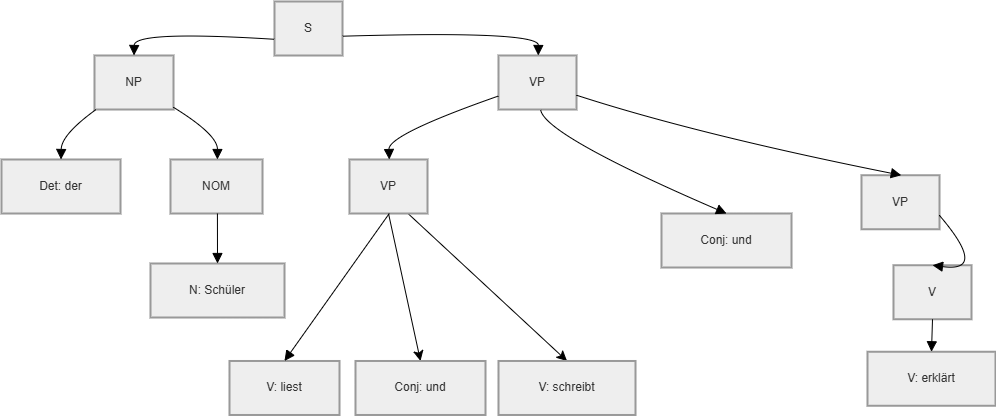
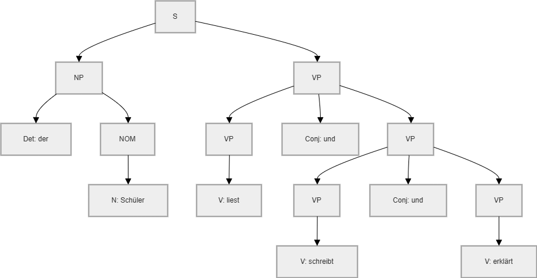
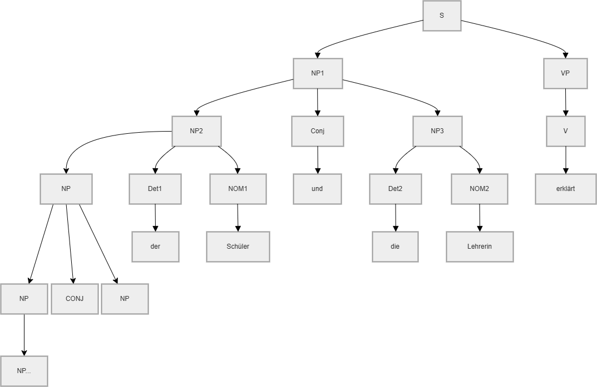
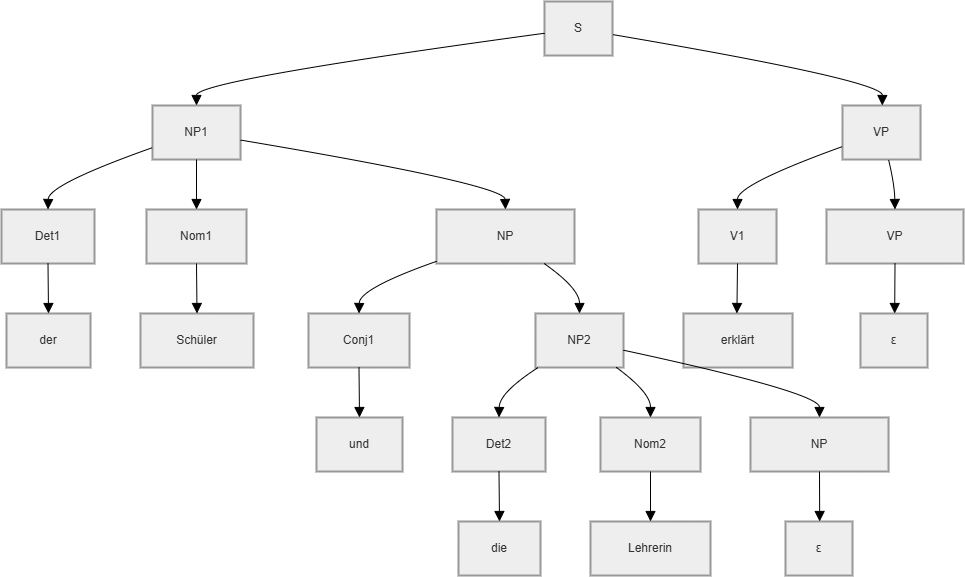
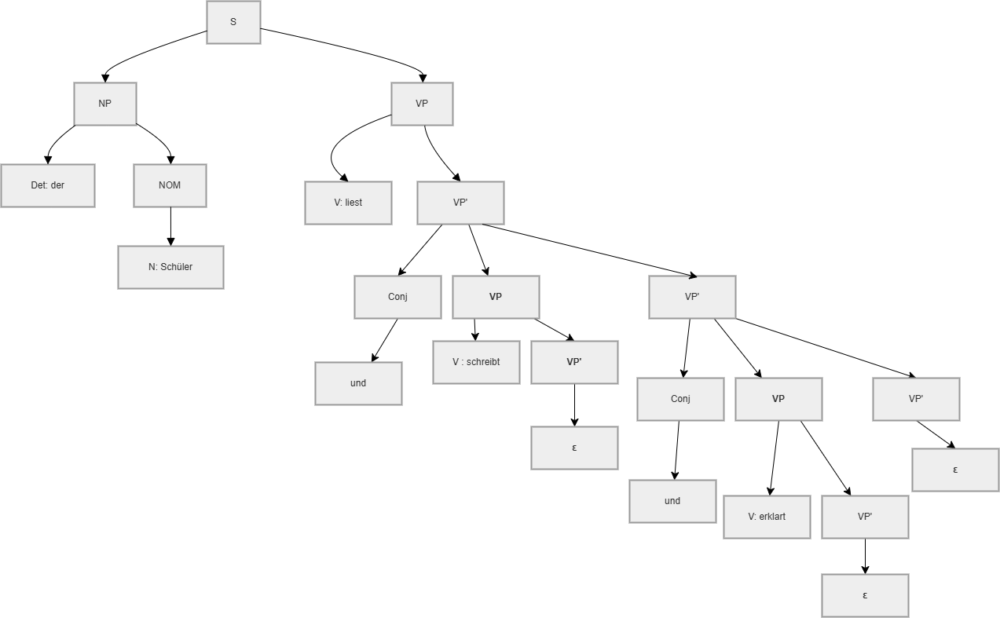

# Evidence-2-Context-Free-Grammar
## Language chosen
### Description
The language chosen  is the German language. More precisely, the language specifically for a school context. This subset focuses on sentences a student would build in the everyday school life.

#### Language Structure
According to (Klein, 2025), the golden German rule in sentence structure is that the verb is the second element in a sentence. But that does not mean that it needs to be the second word. With this in mind, German structure tends to be a bit confusing. <strong> Many sentences can mean the same, but will be with a different structure</strong>. For example:
- Der Schüler liest das Buch
- Das Buch liest der Schüler.<br>
That is why this language is perfect for this project. By eliminating ambiguity, this language will change from an ambiguos natural language to a properly defined grammar. So that we can develop a parser to process the grammar developed.

#### Rules

In German sentence Structure, there are certain structures that represent how a Sentence must follow certain steps to be created. 
- A sentence Structure follows a Noun phrase with a Verb phrase.
- Adjectives before nouns -> For an adjective to be placed in a sentence, its position must be before a Noun.
- Prepositional Phrases -> In german when we use a prepositional element, it must be followed by a noun phrase. Could be represented as PP -> Prep NP
- Conjunctions -> A conjunction is a connection between two verb phrases.
- A Nominal Phrase Can be connected with another by a conjunction.
- A verb phrase can have either a preposition or a connection of conjunction.

### Models
With all the rules previously mentioned, our grammar initially look like this:
```python
S -> NP VP
NP -> NP Conj NP | Det NOM
NOM -> Adj NOM | N
VP -> VP Conj VP | V PP| V NP PP| V NP | V
PP -> Prep NP
Det -> 'der' | 'die' | 'das' | 'ein' | 'eine'
Adj -> 'fleißige' | 'kleine' | 'schwere' | 'neue'|'intelligent'|'interessant'|'alt'
N   -> 'Schüler' | 'Lehrerin' | 'Buch' | 'Klasse' | 'Klassenzimmer'|'Rucksack'|'Kurs'
V   -> 'lesen' | 'schreibt' | 'ist' | 'erklärt' | 'macht'|'machen'
Prep -> 'in' | 'mit' | 'auf'
Conj -> 'und' | 'oder'
```
As you can see, the grammar can be segmented in several types of sentence structures. Which according to (GeeksforGeeks, 2025) could be interpreted as a context Free grammar (CFG). It says that on the left side it can only be a Variable in there, not a terminal, however the right side can be either non terminal or terminal.

For the visualization of the ambiguity and left recursion with our grammar the sentence will  be the following.

"Der Schüler liest und schreibt und erklärt"

With this sentence there are two type of trees that can be made according to our grammar.


Image 1



Image 2

As you can see, both trees represent the same sentence. The difference is how we build the grammar around them. 
With this in mind, we need to analyze our grammar in look for ambiguity and left recursion. By eliminating this, we can make sure that there is only one way to develop a sentence. The rules that generate ambiguity are the following.  

- NP -> NP Conj NP
- VP -> VP Conj VP

The previous trees shown were especifically showing the ambiguity in VP Conj VP.
These two rules also present Left recursion. To understand what is Left Recursion I search through Geeks for Geeks:
- *"Grammar of the form S ⇒ S | a | b is called left recursive where S is any non Terminal and a and b are any set of terminals."(GeeksforGeeks, 2025) *

We can visualize it with this tree.



### Analyze
By analyzing the previous grammar, we come to a realization that we need to eliminate both ambiguity and left Recursion in these rules.

- Ambiguity elimination process
#### Case 1: VP -> VP Conj VP

Original rule:
VP → VP Conj VP | V | V PP | V NP | V NP PP

Applying the elimination pattern:
A  → A α | β  becomes  A → β A' and A' → α A' | ε

Transformed rules:
VP  → V VP' | V PP VP' | V NP VP' | V NP PP VP'
VP' → Conj VP VP' | ε

#### Case 2 NP -> NP Conj NP
Applying the same elimination pattern

Original rule:
NP → NP Conj NP | Det Nom

Transformed rules:
NP  → Det Nom NP'
NP' → Conj NP NP' | ε

- Left Recursion Elimination

Left recursion was eliminated during the process of ambiguity elimination asswell. 
This is because both VP and NP stop appearing in a recursive way at the start of a rule.

#### Syntatic trees for both rules in question
For the rule of NP modified the tree looks like this.

Imagen solucion NP

Imagen solucion VP
#### Correct grammar
```python
S -> NP VP
NP -> Det Nom NP2
NP2 -> Conj NP NP2 | ε
Nom -> Adj Nom | N
VP -> V VP2 | V PP VP2 | V NP VP2 | V NP PP VP2
VP2 -> Conj VP VP2 | ε
PP -> Prep NP
Det -> 'der' | 'die' | 'das' | 'ein' | 'eine' | 'dem'
Adj -> 'fleißige' | 'kleine' | 'schwere' | 'neue' | 'intelligent' | 'interessant' | 'alt'
N -> 'Schüler' | 'Lehrerin' | 'Buch' | 'Klasse' | 'Klassenzimmer' | 'Rucksack' | 'Kurs'
V -> 'liest' | 'schreibt' | 'ist' | 'erklärt' | 'macht'
Prep -> 'in' | 'mit' | 'auf'
Conj -> 'und' | 'oder'

```

### Implementation and tests
The grammar was implemented throguh the library NLTK in python. The program functions as following:
- A function is created with two variables
- First variable is the sentence, second one is what you expect the result.
- True or false are the options for the second variable.
- The function receives the sentence and split it into tokens. This is for the parser to compare between the grammar previously made and the sentence.
- The tree will be formed by each prasing process of the tokens in the sentence.
- Then the result will present the sentence with a message of pass or fail if the assumption you did was correct or no.
- Finally trees show if the sentence is accepted.

Here are the sentences 
# Sentences that SHOULD be accepted
print("=== VALID SENTENCES ===")
test_sentence("der Schüler schreibt", True)
test_sentence("die Lehrerin erklärt das Buch", True)
test_sentence("der fleißige Schüler liest", True)
test_sentence("der Schüler schreibt und macht und erklärt", True)
test_sentence("die Lehrerin ist in dem Klassenzimmer", True)
test_sentence("der Schüler schreibt in das Klassenzimmer", True)

# Sentences that SHOULD be rejected  
print("\n=== INVALID SENTENCES ===")
test_sentence("Schüler der schreibt", False)
test_sentence("der Schüler und", False)
test_sentence("und der Schüler schreibt", False)
test_sentence("der Schüler Schüler", False)

Test documentation should include examples of the pushdown automata or LL1 parsing for the grammar and a specific string.

### Analysis.

#### Chomsky's Hierarchy before elimination of Ambiguity and LR
Before transforming the grammar, it is a CFG (Context-Free Grammar) in Chomsky's Hierarchy.
Reasons:
- Each production rule has one non-terminal on the left
- Right-hand can be terminal or non-terminal
- Affect parsing by ambiguity and left recursion
#### Chomsky's Hierarchy after elimination of Ambiguity and LR
After transforming the grammar, it is still a CFG but has an efficiency in parsing and LL(1)-style.
Reasons:
- The grammar became more efficient for parsing.
- Left recursion eliminated
- Ambiguity eliminated by the cases shown previously.
#### Time implications
Through the LL(1) parsing made by the program, the time complexity for this grammar is considered as O(n). Although type 2 grammars, often represent a time complexity in the worst case of O(n^3), when a ambiguos sentence is presented, several trees can be develop. That is why even though my Grammar is a type 2 grammar, it follows a O(n) because of the elimination of ambiguity.
#### References 
- Klein, A. (2025, March 22). Mastering German Word Order: An Absolute Beginner’s Guide. LearnOutLive. https://learnoutlive.com/german-word-order-guide-for-beginners/

- GeeksforGeeks. (2025, July 23). What is ContextFree Grammar? GeeksforGeeks. https://www.geeksforgeeks.org/theory-of-computation/what-is-context-free-grammar/

- GeeksforGeeks. (2025, July 12). Removing direct and indirect left recursion in a grammar. GeeksforGeeks. https://www.geeksforgeeks.org/dsa/removing-direct-and-indirect-left-recursion-in-a-grammar/

